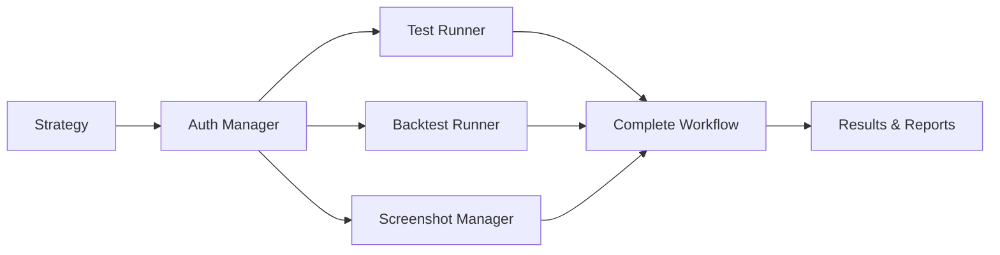

# Kairos Integration Framework

## Overview

The Kairos Integration Framework provides seamless automation between the **trading-setups** repository and **grimm-kairos** for comprehensive trading strategy testing and validation. This integration enables automated TradingView indicator testing, strategy backtesting, and chart screenshot capture with Google OAuth authentication.

## Features

- 🔐 **Google OAuth Authentication** for grimm@greysson.com
- 🧪 **Automated Indicator Testing** across multiple timeframes
- 📊 **Strategy Backtesting** with comprehensive performance analysis
- 📸 **Chart Screenshot Capture** with annotation and comparison
- 📈 **MNQ1! Optimization** - Specialized for Micro E-mini Nasdaq-100 futures
- ⚡ **Async Processing** for parallel operations
- 🔄 **Complete Workflows** from testing to reporting

## Quick Start

### 1. Installation

```bash
# Clone the repository (if not already done)
cd trading-setups

# Install dependencies
pip install -r kairos_integration/requirements.txt

# Ensure grimm-kairos is available in your Python path
export PYTHONPATH="${PYTHONPATH}:/path/to/grimm-kairos"
```

### 2. Authentication Setup

1. Download Google OAuth credentials from [Google Cloud Console](https://console.cloud.google.com/)
2. Save as `credentials.json` in the project root
3. Run initial authentication:

```python
from kairos_integration import GrimmAuthManager

auth = GrimmAuthManager()
auth.authenticate()  # Follow OAuth flow for grimm@greysson.com
```

### 3. Quick Strategy Test

```python
from kairos_integration import CompleteWorkflow

# Initialize workflow
workflow = CompleteWorkflow()

# Run complete strategy testing
results = await workflow.run_complete_workflow("strategies/my-strategy")

# Check results
if results['overall_success']:
    print(f"✅ Strategy validation successful!")
    print(f"Win Rate: {results['backtesting']['summary_metrics']['average_win_rate']:.2%}")
    print(f"Profit Factor: {results['backtesting']['summary_metrics']['average_profit_factor']:.2f}")
else:
    print("❌ Strategy validation failed")
    print(f"Errors: {results['errors']}")
```

## Architecture

### Core Components

```
kairos_integration/
├── core/                      # Core automation classes
│   ├── auth_manager.py        # Google OAuth authentication
│   ├── test_runner.py         # Indicator testing automation
│   ├── backtest_runner.py     # Strategy backtesting
│   └── screenshot_manager.py  # Chart screenshot capture
├── config/                    # Configuration and templates
│   ├── mnq_config.py          # MNQ1! specific configuration
│   └── workflow_templates.py  # Pre-configured workflows
├── workflows/                 # Workflow orchestration
│   └── complete_workflow.py   # End-to-end automation
└── tests/                     # Integration tests
```

### Integration Flow



## Components

### 1. Authentication Manager (`GrimmAuthManager`)

Handles secure Google OAuth authentication for TradingView automation.

```python
from kairos_integration import GrimmAuthManager

auth = GrimmAuthManager()
if auth.authenticate():
    print(f"✅ Authenticated as {auth.get_user_email()}")
    session_data = auth.get_session_data()
```

**Features:**
- Secure OAuth2 flow for grimm@greysson.com
- Automatic token caching and refresh
- Session persistence across runs
- Comprehensive error handling

### 2. Test Runner (`TradingViewTestRunner`)

Automates indicator testing on TradingView with real-time data extraction.

```python
from kairos_integration import TradingViewTestRunner, TestConfiguration

test_runner = TradingViewTestRunner(auth_manager)

config = TestConfiguration(
    strategy_path="strategies/my-strategy",
    indicators=["RSI", "MACD", "EMA"],
    tickers=["MNQ1!"],
    timeframes=["5m", "1h", "4h"],
    test_duration=300,
    capture_screenshots=True
)

results = await test_runner.test_strategy_indicators(config)
```

**Features:**
- Multi-symbol and multi-timeframe testing
- Real-time indicator value extraction
- Signal generation and analysis
- Parallel processing for efficiency
- Screenshot capture during testing

### 3. Backtest Runner (`StrategyBacktester`)

Provides comprehensive strategy backtesting with performance analysis.

```python
from kairos_integration import StrategyBacktester, BacktestConfiguration

backtester = StrategyBacktester(auth_manager)

config = BacktestConfiguration(
    strategy_path="strategies/my-strategy",
    tickers=["MNQ1!"],
    timeframes=["5m", "1h"],
    initial_capital=25000.0,
    commission=0.75,
    slippage=0.25,
    optimization_enabled=True
)

results = await backtester.backtest_strategy(config)
```

**Features:**
- Comprehensive performance metrics
- Parameter optimization
- Risk analysis and validation
- Trade-by-trade analysis
- Multiple timeframe backtesting

### 4. Screenshot Manager (`ChartScreenshotManager`)

Captures high-quality annotated chart screenshots for documentation.

```python
from kairos_integration import ChartScreenshotManager, ScreenshotConfiguration

screenshot_manager = ChartScreenshotManager(auth_manager)

config = ScreenshotConfiguration(
    strategy_name="My Strategy",
    ticker="MNQ1!",
    timeframe="1h",
    annotation_enabled=True,
    theme="dark"
)

result = await screenshot_manager.capture_chart_screenshot(config)
```

**Features:**
- High-quality chart capture
- Automatic annotation and labeling
- Multiple themes and chart styles
- Thumbnail generation
- Comparison image creation

### 5. Complete Workflow (`CompleteWorkflow`)

Orchestrates end-to-end strategy testing and validation.

```python
from kairos_integration import CompleteWorkflow

workflow = CompleteWorkflow()

# Run complete workflow
results = await workflow.run_complete_workflow("strategies/my-strategy")

# Or run quick validation
quick_results = await workflow.run_quick_workflow("strategies/my-strategy")
```

**Features:**
- End-to-end automation
- Comprehensive reporting
- Error handling and recovery
- Performance monitoring
- Results aggregation

## MNQ1! Configuration

The framework is optimized for **MNQ1!** (Micro E-mini Nasdaq-100) futures testing:

```python
from kairos_integration.config import create_mnq_config

config = create_mnq_config()
print(f"Symbol: {config.symbol}")                    # MNQ1!
print(f"Commission: ${config.commission_per_side}")  # $0.75
print(f"Contract Size: ${config.contract_size}")     # $2 per point
print(f"Tick Size: {config.minimum_tick}")           # 0.25 points
```

### Why MNQ1!?

- **High Liquidity**: 500,000+ contracts daily volume
- **24-Hour Trading**: Nearly continuous market access
- **Low Capital Requirements**: $1,320 typical margin
- **Tight Spreads**: Typically 0.25 points
- **Consistent Behavior**: Reliable for automated testing

### Performance Benchmarks

- **Minimum Win Rate**: 45%
- **Minimum Profit Factor**: 1.25
- **Maximum Drawdown**: 15%
- **Target Annual Return**: 30%
- **Minimum Sharpe Ratio**: 1.0

## Workflow Templates

### Complete Strategy Workflow

```yaml
name: Complete Strategy Development
steps:
  - authenticate with Google OAuth
  - load strategy from directory
  - test indicators on MNQ1!
  - run comprehensive backtesting
  - capture annotated screenshots
  - generate performance report
```

### Quick Test Workflow

```yaml
name: Quick Strategy Test
steps:
  - quick authentication check
  - test key indicators on MNQ1! 1h
  - quick backtest validation
  - capture setup screenshot
```

### Indicator Research Workflow

```yaml
name: Indicator Research
steps:
  - multi-timeframe indicator testing
  - correlation analysis
  - signal strength analysis
  - visual comparison creation
```

## Usage Examples

### Example 1: Test New Strategy

```python
import asyncio
from kairos_integration import CompleteWorkflow

async def test_new_strategy():
    workflow = CompleteWorkflow()
    
    # Test the strategy
    results = await workflow.run_complete_workflow("strategies/rsi-momentum")
    
    if results['overall_success']:
        metrics = results['backtesting']['summary_metrics']
        print(f"✅ Strategy validated successfully!")
        print(f"📊 Win Rate: {metrics['average_win_rate']:.2%}")
        print(f"💰 Profit Factor: {metrics['average_profit_factor']:.2f}")
        print(f"📉 Max Drawdown: {metrics['average_max_drawdown']:.2%}")
        
        # Check if meets benchmarks
        if metrics['meets_benchmarks']['overall_benchmark']:
            print("🎯 Strategy meets all performance benchmarks!")
        else:
            print("⚠️  Strategy does not meet all benchmarks")
    else:
        print("❌ Strategy validation failed")
        for error in results['errors']:
            print(f"   Error: {error}")

# Run the test
asyncio.run(test_new_strategy())
```

### Example 2: Quick Indicator Test

```python
from kairos_integration import TradingViewTestRunner, GrimmAuthManager

async def quick_indicator_test():
    # Authenticate
    auth = GrimmAuthManager()
    if not auth.authenticate():
        print("❌ Authentication failed")
        return
    
    # Run quick test
    test_runner = TradingViewTestRunner(auth)
    summary = await test_runner.run_quick_test("strategies/ma-crossover")
    
    print(f"Tests completed: {summary['successful_tests']}/{summary['total_tests']}")
    print(f"Average execution time: {summary['average_execution_time']:.2f}s")

asyncio.run(quick_indicator_test())
```

### Example 3: Batch Screenshot Capture

```python
from kairos_integration import ChartScreenshotManager, GrimmAuthManager

async def capture_strategy_charts():
    auth = GrimmAuthManager()
    auth.authenticate()
    
    screenshot_manager = ChartScreenshotManager(auth)
    
    # Capture multiple timeframes
    results = await screenshot_manager.capture_strategy_screenshots(
        strategy_name="Bollinger Bands Scalper",
        tickers=["MNQ1!"],
        timeframes=["5m", "15m", "1h", "4h"]
    )
    
    successful = [r for r in results if r.success]
    print(f"📸 Captured {len(successful)} screenshots")
    
    # Create comparison image
    if len(successful) > 1:
        screenshot_paths = [r.file_path for r in successful]
        comparison_path = "./comparison.png"
        await screenshot_manager.create_comparison_image(screenshot_paths, comparison_path)
        print(f"🖼️  Comparison image: {comparison_path}")

asyncio.run(capture_strategy_charts())
```

## Configuration

### Environment Variables

```bash
# Optional configuration via environment variables
export KAIROS_CONFIG_FILE="custom_config.yaml"
export KAIROS_LOG_LEVEL="DEBUG"
export KAIROS_BROWSER="chrome"
export KAIROS_WAIT_TIME="45"
```

### Custom MNQ Configuration

```python
from kairos_integration.config import create_mnq_config

# Custom settings for different trading styles
scalping_config = create_mnq_config({
    'test_timeframes': ['1m', '5m'],
    'default_stop_loss': 5.0,
    'default_take_profit': 10.0,
    'position_size_default': 2
})

swing_config = create_mnq_config({
    'test_timeframes': ['1h', '4h', '1d'],
    'default_stop_loss': 25.0,
    'default_take_profit': 50.0,
    'initial_capital': 50000.0
})
```

## Testing

### Run Integration Tests

```bash
# Install test dependencies
pip install pytest pytest-asyncio

# Run all tests
pytest kairos_integration/tests/ -v

# Run specific test
pytest kairos_integration/tests/test_integration.py::TestMNQConfiguration -v

# Run with coverage
pytest kairos_integration/tests/ --cov=kairos_integration --cov-report=html
```

### Manual Testing

```python
# Quick integration test
from kairos_integration.tests.test_integration import run_integration_tests
run_integration_tests()
```

## Troubleshooting

### Common Issues

#### Authentication Problems
```
❌ Authentication failed
```
**Solutions:**
- Verify `credentials.json` is in the correct location
- Check grimm@greysson.com has necessary permissions
- Clear cached tokens: `rm -rf ~/.kairos_auth/`

#### Browser Automation Issues
```
❌ WebDriver not found
```
**Solutions:**
- Ensure Chrome/Chromium is installed
- Update Chrome to latest version
- Check firewall settings

#### TradingView Access
```
❌ Failed to load TradingView
```
**Solutions:**
- Verify TradingView account is active
- Check internet connection
- Increase wait times in configuration

### Debug Mode

```python
import logging

# Enable debug logging
logging.basicConfig(level=logging.DEBUG)

# Run with detailed output
workflow = CompleteWorkflow()
results = await workflow.run_complete_workflow("strategies/debug-strategy")
```

## Performance Optimization

### Parallel Processing

```python
# Enable parallel execution for faster testing
config = TestConfiguration(
    strategy_path="strategies/my-strategy",
    parallel_execution=True,
    max_workers=4
)
```

### Caching

```python
# Browser session reuse
screenshot_manager = ChartScreenshotManager(
    auth_manager,
    kairos_config={'session_reuse': True}
)
```

### Resource Management

```python
# Monitor performance
from kairos_integration.core import PerformanceMonitor

monitor = PerformanceMonitor()
with monitor.performance_timer('strategy_test'):
    results = await test_runner.test_strategy_indicators(config)

stats = monitor.get_operation_stats('strategy_test')
print(f"Execution time: {stats['average_time']:.2f}s")
```

## Contributing

### Development Setup

```bash
# Clone repository
git clone <repository-url>
cd trading-setups

# Install development dependencies
pip install -r kairos_integration/requirements.txt

# Install pre-commit hooks
pre-commit install

# Run tests
pytest kairos_integration/tests/
```

### Code Style

```bash
# Format code
black kairos_integration/

# Lint code
flake8 kairos_integration/

# Type checking
mypy kairos_integration/
```

## License

This project is licensed under the same terms as the trading-setups repository.

## Support

For issues and questions:

1. Check the [troubleshooting section](#troubleshooting)
2. Review the [integration tests](tests/test_integration.py)
3. Open an issue in the trading-setups repository

---

**Integration Status**: ✅ Fully integrated with grimm-kairos v3.0  
**Authentication**: 🔐 Google OAuth for grimm@greysson.com  
**Default Ticker**: 📈 MNQ1! (Micro E-mini Nasdaq-100)  
**Automation Level**: 🚀 Complete end-to-end workflow automation